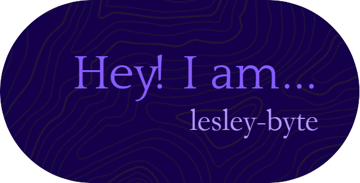

 

### Hi there 👋

# I'm lesley-byte

## My Portfolio:

[Link to Portfolio](lesley-byte.github.io/react-portfolio/)

## Fun facts about me:

- 😻🐈I have one black cat.
- 🎈🧶🎮I am interested in electronics, knitting, programming, and Science fiction novels.
- ⚡I can knit without looking at my hands.
- 💻I want to become an expert in python programming.
- ✨I strive to leave the world a better place than I found it.
- 🐱‍🚀I've lived in the USA my whole life.
- 🔭I'm currently attending a full stack coding bootcamp and love it!
- 🌱I'm currently learning HTML, CSS, JavaScript...etc.
- 😄Pronouns: I respond to all the pronouns. Sort of agnostic about that.  Maybe She/her
<!--
**lesley-byte/lesley-byte** is a ✨ _special_ ✨ repository because its `README.md` (this file) appears on your GitHub profile.

Here are some ideas to get you started:

- 🔭 I’m currently working on ...
- 🌱 I’m currently learning ...
- 👯 I’m looking to collaborate on ...
- 🤔 I’m looking for help with ...
- 💬 Ask me about ...
- 📫 How to reach me: ...
- 😄 Pronouns: ...
- ⚡ Fun fact: ...
-->
